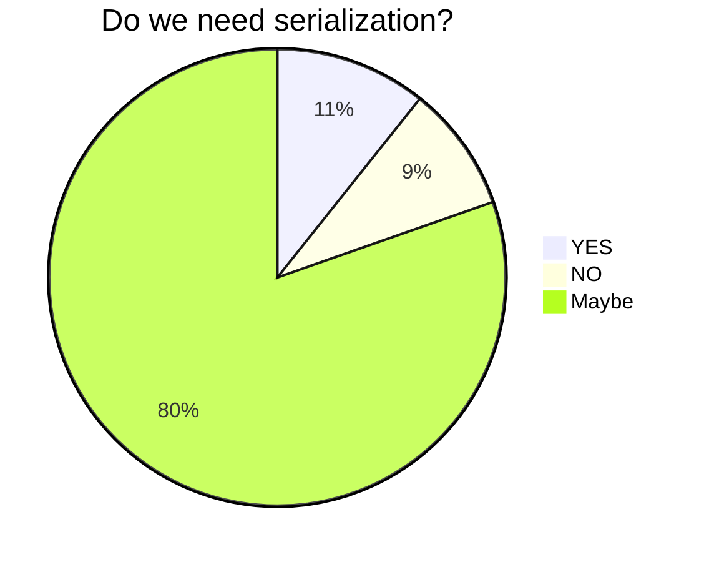
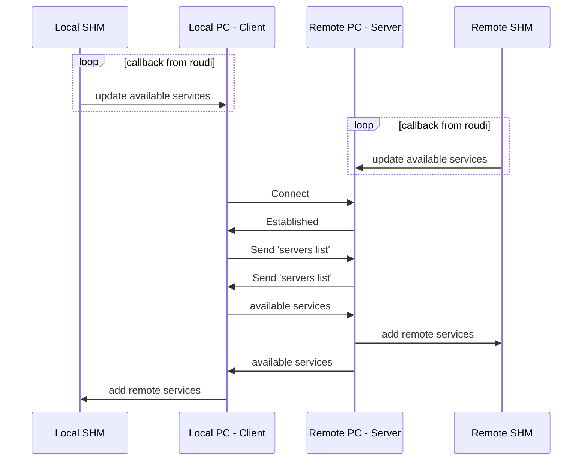

# tcpicep

## About

## Idea

TCP-IP Communication for Iceoryx using a peer to peer architecture. Ignoring serialization in the first place and assuming a trusted network.

### Trusted Network

A trusted network in a un-trusted environment could be created using port forwarding via ssh.

### Serialization

Data serialization can be ignored as long as the ABI regarding memory layout is identical. This could be checked per service for every service could have had been compiled with different ABI flags. To ensure compatibility a identical docker container could be used to build the different applications.

## Structure

## Network Service Discovery

## Data Structure

### Servers List

Servers list with information about each server:

- Address
- Connectivity Status
- maybe known services
